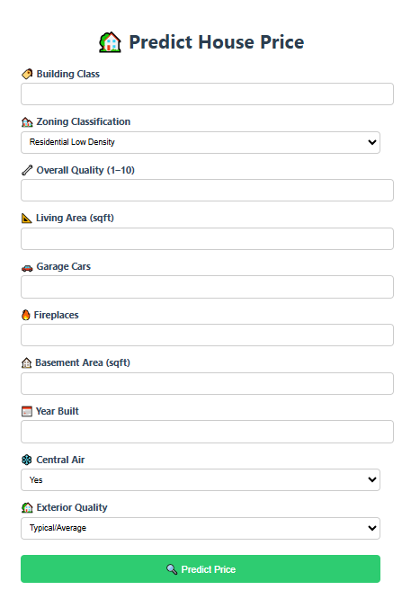
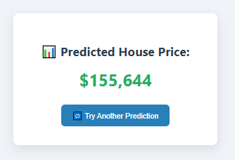

# 🏡 House Price Predictor

A complete end-to-end machine learning project to **predict house prices** based on property features — from exploratory data analysis to a real-time **Flask web app**.

Users can input details like square footage, garage size, and year built, and instantly receive a **predicted sale price** based on trained regression models.

---

## 🚀 Live App Preview

### 🧾 Input Form


### 📈 Prediction Output


---

## 🎯 Project Highlights

✅ Turned a Jupyter notebook into a working tool  
✅ Trained and evaluated multiple regression models  
✅ Built a user-friendly web interface with Flask  
✅ Containerized the app with Docker for easy deployment

---

## 🧱 Tech Stack Overview

### ⚙️ Backend
- **Python** – Main programming language
- **Flask** – Lightweight web framework for routing and templates
- **joblib** – Load serialized models for prediction
- **pandas** – Input feature formatting and processing

### 🧠 Machine Learning
- **scikit-learn** – Linear, Ridge, and Lasso regression models
- **XGBoost** – High-performance gradient boosting
- **joblib** – Model saving/loading

### 📊 Data & EDA
- **pandas**, **numpy** – Data manipulation
- **seaborn**, **matplotlib** – Visualizations
- **missingno** – Missing value analysis

### 🌐 Frontend
- **HTML5 & CSS3** – UI design
- **Jinja2** – Templating engine for dynamic pages

---

## ⚙️ Run the App Locally

1. **Clone the repository**
   ```bash
   git clone https://github.com/manal-babkhouti/house-price-predictor.git
   cd house-price-predictor
   ```

2. **Install dependencies**
   ```bash
   pip install -r requirements.txt
   ```

3. **Run the Flask app**
   ```bash
   python app.py
   ```

4. **Access the app**
   ```
   http://localhost:5000
   ```

---

## 📦 Docker Setup (Optional)

To run the app inside Docker:

```bash
docker build -t house-price-app .
docker run -p 5000:5000 house-price-app
```

---

## 🤖 Model Performance & Evaluation

The following models were trained and compared:

- Linear Regression  
- Ridge Regression  
- Lasso Regression  
- XGBoost Regressor  

**Evaluation Metrics:**

- R² Score  
- Mean Squared Error (MSE)  
- Actual vs. Predicted plots

📌 _Note: The target variable `SalePrice` was log-transformed to improve performance._

✅ The best-performing model was saved as `model.pkl` and integrated into the live app.

---

## 📁 Project Structure

```text
house-price-predictor/
│
├── app.py                   # Flask app entrypoint
├── templates/
│   └── form.html            # User input HTML form
│
├── Dockerfile               # Container setup
├── requirements.txt         # Python dependencies
├── README.md                # Project documentation
│
├── EDA_to_model.ipynb       # Notebook: EDA + model training
│
├── data/
│   ├── train.csv            # Raw training data
│   └── test.csv             # Raw test data
│
├── images/
│   ├── form.PNG             # Screenshot: input form
│   └── result.PNG           # Screenshot: result page
│
└── models/
    ├── model.pkl            # Final saved model
    └── xgb_best_pipeline.pkl
```

---

## 👩‍💻 About Me

**Manal Babkhouti**  
Engineering Student | Data & AI Enthusiast  
Building real-world ML tools while learning — one project at a time.

🔗 [LinkedIn](https://www.linkedin.com/in/manal-babkhouti/) | [GitHub](https://github.com/manal-babkhouti)

---

## 📘 Read the Full Report

👉 The complete analysis, from EDA to model selection, is detailed in the notebook below:  
📄 [View EDA_to_model.ipynb on GitHub](https://github.com/manal-babkhouti/house-price-predictor/blob/main/EDA_to_model.ipynb)
